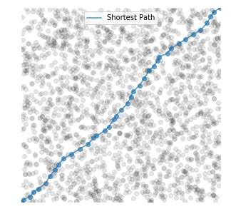
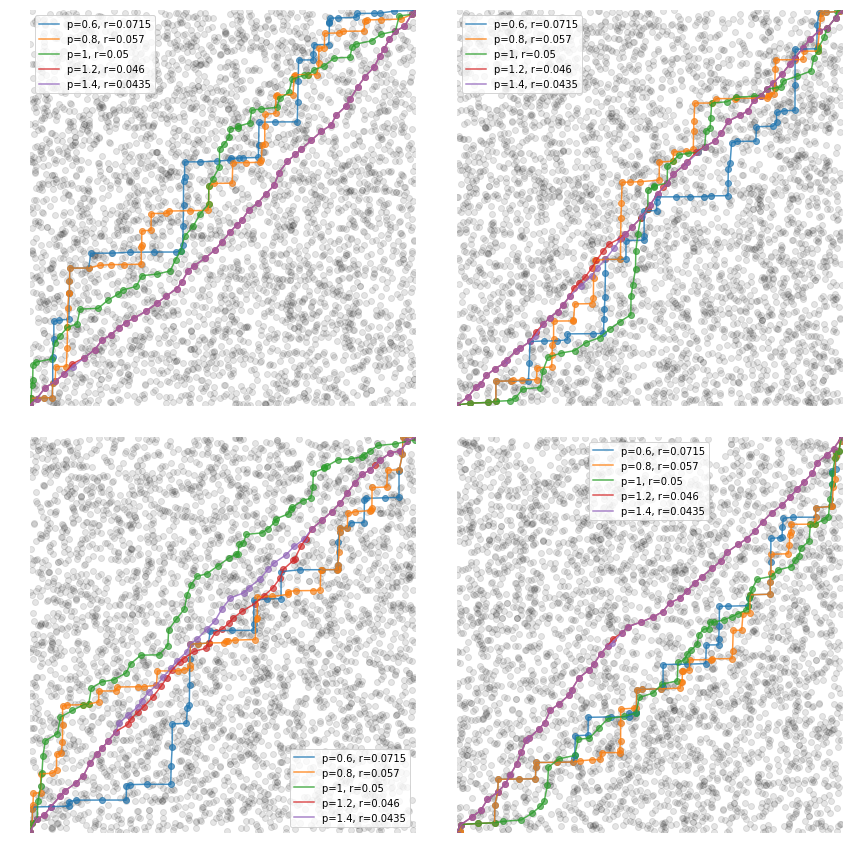

# DAGmetrics

Tools to investigate properties of DAGs, focussing on path lengths and Minkoswki distance. A few features are shown below, see the *Examples* Jupyter Notebook for more utilities and interactive code.

```python
import minkowski_tools as mt
```
**Generate random points and plot them quickly.** Points uniformly  distributed using uniform [Poission Point Process](https://en.wikipedia.org/wiki/Poisson_point_process) and constrained between 0 and 1. Finding the **shortest path** accross the space using the Minkowski distance (here use `p=2`), and connecting points within radius 0.05 in the upper left direction.

```python
n=2000
rand_points = np.random.uniform(size=(2, n-2))
edge_points = np.array([[0.0, 1.0],[0.0, 1.0]])
points = np.concatenate((rand_points, edge_points), axis=1)
```

```python
connections = mt.get_connections(points, pval=2, radius=.05)
short_path = mt.shortest_path(connections)
_ = [print('-> {}'.format(ind), end=' ') for ind in short_path]
```

**1999 -> 5 -> 1324 -> 613 -> 225 -> 332 -> 1888 -> 1453 -> 602 -> 890 -> 1054 -> 733 -> 1624 -> 306 -> 1192 -> 899 -> 1408 -> 339 -> 616 -> 327 -> 85 -> 244 -> 444 -> 1269 -> 1980 -> 1345 -> 288 -> 1430 -> 1852 -> 1013 -> 1047 -> 709 -> 1182 -> 1722 -> 422 -> 1555 -> 907 -> 703 -> 1998**

```python
fig, ax = plt.subplots(figsize=(5, 5))
mt.plot_points_simple(ax, points, [short_path], ['Shortest Path'])
```


**Varying the Minkowski distance p value** and visualising the results.
6
```python
n=4000

fig, axes = plt.subplots(2, 2, figsize=(12,12))
ps, rs = [0.8, 1, 1.2], [0.2, 0.1, 0.1]

ps = [0.6, 0.8, 1, 1.2, 1.4]
r_rel = np.array([1.43, 1.14, 1, 0.92, 0.87])
rs = r_rel/20

print('Generating points', end=' ')
ensemble_points = [np.concatenate((np.random.uniform(size=(2, n-2)), np.array([[0.0, 1.0],[0.0, 1.0]])), axis=1) for count in range(4)]
print()

for points, ax in zip(ensemble_points, axes.flatten()):

    path_labels = ['p={}, r={:.3}'.format(p, r) for p, r in zip(ps, rs)]
    diff_connections = [mt.get_connections(points, pval=p, radius=r) for p, r,label in zip(ps, rs, path_labels)]
    short_paths = [mt.shortest_path(connections) for connections, label in zip(diff_connections, path_labels)]

    mt.plot_points_simple(ax, points, short_paths, path_labels)

plt.tight_layout()
```



```python

```
